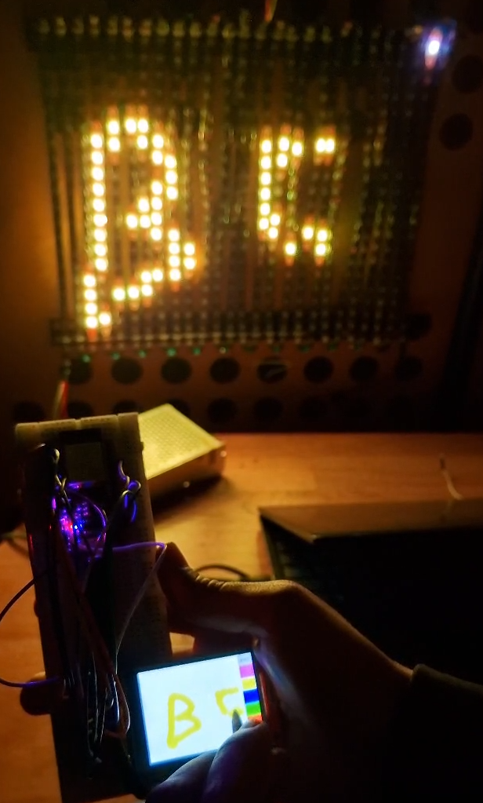

# TouchSync

**TouchSync** is a wireless, interactive lighting system built with two ESP32 boards, a capacitive TFT touchscreen, and an RGB LED strip. Touch input on the screen is mirrored in real-time on a corresponding LED in the strip — thanks to ESP-NOW communication.

---

## ✨ Project Overview

- **ESP32 #1** connects to the **TFT capacitive touchscreen**. It detects touch input and calculates screen coordinates.
- **ESP32 #2** drives the **RGB LED strip**, arranged to match the screen’s layout (rectangle).
- The two ESP32s communicate over **ESP-NOW**, a fast, connectionless wireless protocol by Espressif.

This creates a smooth, low-latency system where each touch lights up the corresponding LED, creating a “mirror” of touch on the strip.

---

## 🧩 Hardware Components

- 2 × **ESP32 Dev Boards**
- 1 × **SPI Capacitive TFT Touchscreen** (e.g., ILI9488 with XPT2046)
- 1 × **WS2812B RGB LED Strip** (arranged to match the screen layout)
- Power source (USB or battery)
- Optional: Level shifter (for LED strip, if 5V)

---

## 📡 Communication

### ESP-NOW

- No Wi-Fi router is required.
- **ESP32 #1 (Touch)** sends touch coordinates.
- **ESP32 #2 (LED)** receives and processes the LED command.

Both ESP32s must be on the same Wi-Fi channel, and peer MAC addresses must be registered.

---

## 🔌 System Wiring

### ESP32 #1 — Touch Controller

- Communicates with TFT screen over SPI
- Detects touch coordinates
- Sends mapped data via ESP-NOW

### ESP32 #2 — LED Controller

- Drives RGB LED strip
- Receives LED index and color via ESP-NOW
- Lights up the corresponding LED

---

## 📸 Media

### Demo Images

  
*Touchscreen connected to ESP32 #1*

### Video Demonstration

  
*Click to watch the demo (MP4 video)*

---

## 🚀 Workflow

1. User touches screen.
2. ESP32 #1 maps the (X, Y) coordinates to an LED index.
3. The LED index is sent wirelessly to ESP32 #2 using ESP-NOW.
4. ESP32 #2 lights up the mapped LED on the RGB strip.

---

## 💡 Customization Ideas

- Add color control (e.g., rainbow or pressure-based)
- Multi-touch (if your display supports it)
- LED animations on touch
- Use screen gestures to trigger patterns

---

## 📁 Folder Structure

